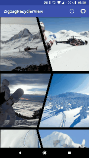

# Zigzag Recycler View

A library that gives you a slant on the traditional Grid Recycler View!

* Use a traditional RecyclerView (& just apply the ZigzagGridRecyclerViewAdapter)
* Load list of images from your own objects (implement ZigzagImage)
* Change the background of the dividers

<p>
<a href="https://play.google.com/store/apps/details?id=uk.co.barbuzz.zigzagrecyclerview.sample"></a>
</p>
<p>

</p>
  
<!---->

### Setup
To use **Zigzag Recycler View** in your projects, simply add the library as a dependency to your build.

##### Gradle
```
dependencies {
  compile 'uk.co.barbuzz:zigzagrecyclerview:0.0.1'
}
```

##### Maven
```
<dependency>
  <groupId>uk.co.barbuzz.zigzagrecyclerviewadapter</groupId>
  <artifactId>zigzagrecyclerview</artifactId>
  <version>0.0.1</version>
  <type>pom</type>
</dependency>
```

Alternatively you can directly import the /library project into your Android Studio project and add it as a dependency in your build.gradle.

The library is currently configured to be built via Gradle only. It has the following dependencies:

* Support library         - com.android.support:appcompat-v7:26.1.0
* Recyclerview-v7         - com.android.support:recyclerview-v7:26.1.0
* Picasso 2.3.2           - com.squareup.picasso:picasso:2.5.2
* Compiled SDK Version    - Oreo-26
* Minimum SDK Version     - >= Lollipop-21

### Usage
For more detailed code example to use the library, Please refer to the `/sample` app.

`ZigzagGridRecyclerViewAdapter` can be used with a standard RecyclerView. Declare the RecyclerView as normal in your layout XML.

```
<android.support.v7.widget.RecyclerView
        android:id="@+id/zigzag_recycler_view"
        android:layout_width="match_parent"
        android:layout_height="match_parent"/>
```

Make sure your class in the list that your passing into the RecylerView implements the ZigzagImage interface
(either returning a value for `getImageResourceId()` or `getImageUrl()` depending on how you supply your image data).

`NOTE:` images are loaded by the Picasso library at the moment

```
public class SnowImage extends ZigzagImage {

    private int spaceImageResourceId;

    public SnowImage(int spaceImageResourceId) {
        this.spaceImageResourceId = spaceImageResourceId;
    }

    @Override
    protected String getZigzagImageUrl() {
        return null;
    }

    @Override
    protected int getZigzagImageResourceId() {
        return spaceImageResourceId;
    }
}
```

Then initialise the `RecyclerView` & `ZigzagGridRecyclerViewAdapter` in your activity as below.

```
LinearLayoutManager linearLayoutManager = new LinearLayoutManager(this);
ZigzagGridRecyclerViewAdapter zigzagGridRecyclerViewAdapter = new ZigzagGridRecyclerViewAdapter(this, imageList, this);
zigzagGridRecyclerViewAdapter.setBackgroundColourResId(getResources().getColor(R.color.separator));

RecyclerView zigzagRecyclerView = findViewById(R.id.zigzag_recycler_view);
zigzagRecyclerView.setLayoutManager(linearLayoutManager);
zigzagRecyclerView.setAdapter(zigzagGridRecyclerViewAdapter);
```

You can also optionally change the separator colour (defaults to white) like this.

```
zigzagGridRecyclerViewAdapter.setBackgroundColourResId(getResources().getColor(R.color.separator));
```

### TODO
1. Maybe add a optional label to bottom of image
2. Allow change of the separator width

### Thanks

This library has been made by using the amazing library Oblique below. So huge thanks to the author which this is based on.

* Oblique by [akshay2211](https://github.com/akshay2211) - [https://github.com/akshay2211/Oblique](https://github.com/akshay2211/Oblique)


### Licence
```
Copyright (c) 2016 Andy Barber

Licensed under the Apache License, Version 2.0 (the "License");
you may not use this file except in compliance with the License.
You may obtain a copy of the License at

  http://www.apache.org/licenses/LICENSE-2.0

Unless required by applicable law or agreed to in writing, software
distributed under the License is distributed on an "AS IS" BASIS,
WITHOUT WARRANTIES OR CONDITIONS OF ANY KIND, either express or implied.
See the License for the specific language governing permissions and
limitations under the License.
```
